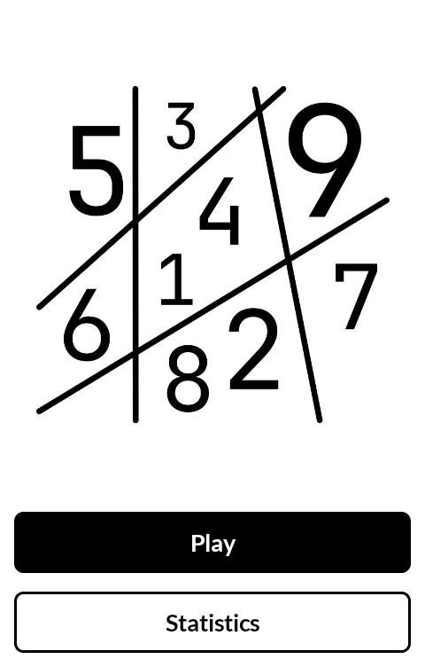
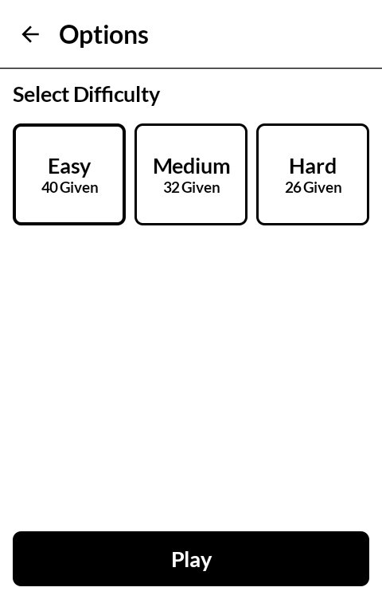
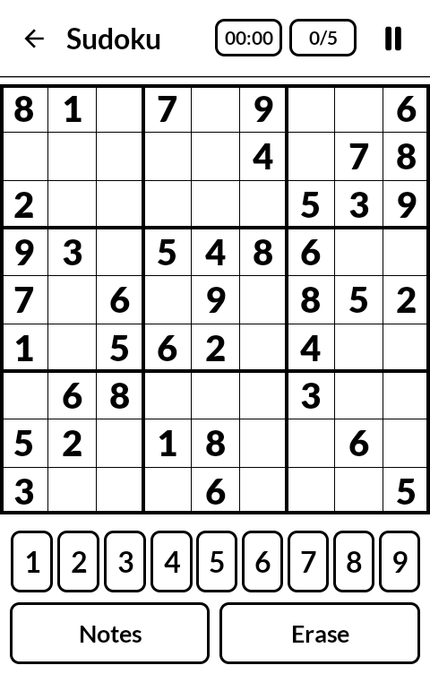
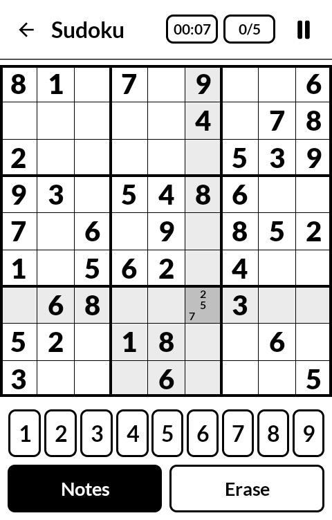
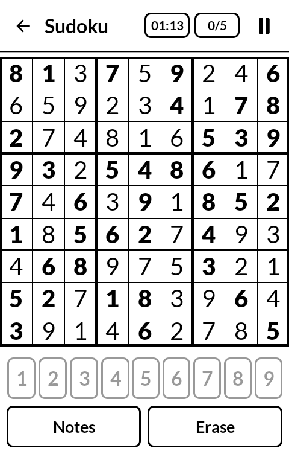
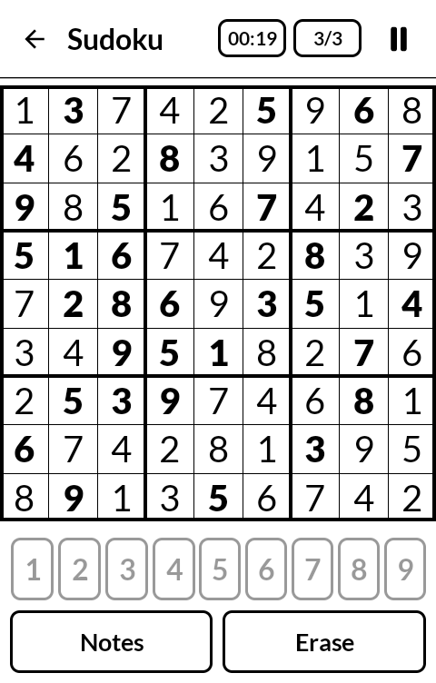
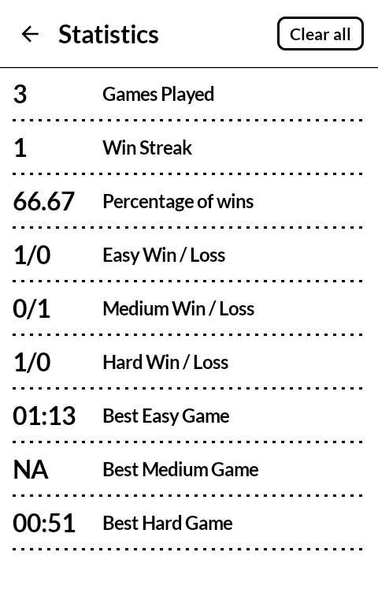

# Calm Sudoku

## Background

A companion to my [minesweeper](https://github.com/CBaier33/minesweeper) app, built in the same style for the [Mudita Kompakt](https://mudita.com/) and its e-ink screen.

Every board is generated on the device. A solved grid is built first, then cells are removed one at a time and each removal is kept only if the puzzle still has exactly one solution, so there is always a way to reason your way to the answer without guessing.

The app is native Kotlin/Jetpack Compose, built on [Mudita Mindful Design (MMD)](https://github.com/mudita/MMD) — Mudita's Apache-2.0 Compose component library for E Ink displays. 

## Installation

You may either install from the Releases section of this project (I recommend using [Obtainium](https://wiki.obtainium.imranr.dev/)) or you may build from source.

```sh
./scripts/install.sh   # build a signed release APK and push it to a connected device
```

### Screenshots

<table>
  <tr>
    <td align="center">
      <br>
    </td>
    <td align="center">
      <br>
    </td>
    <td align="center">
      <br>
    </td>
  </tr>
  <tr>
    <td align="center">
      <br>
    </td>
    <td align="center">
      <br>
    </td>
    <td align="center">
      <br>
    </td>
  </tr>
  <tr>
    <td align="center">
      <br>
    </td>
    <td></td>
    <td></td>
  </tr>
</table>

## Play

- **Tap** a cell to select it, then tap a digit on the pad to fill it in.
- **Long press** a cell to clear it.
- **Notes** switches the pad to pencil marks, so a digit is jotted into the corner of the cell instead of being played.
- **Erase** empties the selected cell.

A wrong digit inverts the cell and costs you one of your mistakes — five on easy, three on medium and hard. Run out and the grid reveals itself. The counters across the top are cells left to solve, the mistakes you have spent, and your time. Tap the face to deal a new puzzle.

## Saved games

**Save & Quit** in the pause menu puts the board down mid-play; **Resume** on
the options screen picks it back up.

There is one slot per difficulty, keyed `game_easy` / `game_medium` /
`game_hard` in a `saved_games` DataStore of its own, so a board can never take
the statistics with it. A slot holds the grid, the pencil marks, the mistakes
and the clock — see `game/SavedGame.kt` for the encoding.

A slot is written only by an explicit Save & Quit. It is emptied by an
overwrite, or when the game that occupies it ends — by being finished, or by
**Quit**, which is the way to throw a save away without having to solve it.
Quitting a game in play asks first, and says which of the two is about to
happen.

Everything turns on whether the board on screen *is* the one in the slot, which
`GameUiState.inSaveSlot` tracks: set by resuming or saving, given up by dealing
a new puzzle. Quitting or finishing any other board — a fresh puzzle started at
a difficulty that already has a save — leaves that save exactly where it was.

## Build

```bash
./gradlew :app:testDebugUnitTest    # generator + game rules
./gradlew :app:assembleDebug
./gradlew :app:installDebug
```

Requires JDK 17+ and an Android SDK with platform 35. `local.properties` must
point `sdk.dir` at the SDK (it is gitignored and generated on first build by
Android Studio).

A debug build cannot upgrade a release-signed install of the same
`applicationId`. If `adb` refuses with `INSTALL_FAILED_UPDATE_INCOMPATIBLE`,
run `adb uninstall com.cbaier33.sudoku` once first.

MMD 1.0.2 is compiled against **material3 1.3.1** and uses
`LocalRippleConfiguration`, which was experimental in that line. `material3` and
`compose-ui` are pinned to explicit versions in `gradle/libs.versions.toml`
rather than floating on a Compose BOM. After changing any Compose version, check
that MMD still gets what it expects:

```bash
./gradlew :app:dependencies --configuration debugRuntimeClasspath \
  | grep -E 'mudita|material3'
```

`com.mudita:MMD` is a Kotlin Multiplatform root module; Gradle redirects it to
`com.mudita:MMD-android` through module metadata.

## Notes on MMD

Two gaps are patched in `theme/AppTheme.kt`:

- `eInkColorScheme` leaves six surface slots `Color.Unspecified`
  (`surfaceBright`, `surfaceDim`, `surfaceContainer`, `surfaceContainerHigh`,
  `surfaceContainerHighest`, `surfaceContainerLowest`). `TopAppBarMMD` reads
  `surfaceContainer`, so they are all set to white.
- MMD asks for `FontWeight.Medium` everywhere, but its bundled Lato family
  registers no W500 face, so its text resolves to Lato Regular. The board picks
  `Black` and `Light` explicitly — both exact matches — to keep givens visually
  distinct from entered digits.

MMD provides no grid, `Scaffold`, `Icon`, `IconButton` or dialog. The board is
hand-drawn on a `Canvas`; the rest come from stock Material 3, which inherits
MMD's theme and its globally disabled ripple.

`ExperimentalMaterial3Api` is opted into once in `app/build.gradle.kts`, since
`TopAppBarMMD` and `ModalBottomSheetMMD` both expose it.

## Contributing

PRs and forks would be cool however unlikely. I've kept it simple but there are a lot of features I could see for this and perhaps web support.
